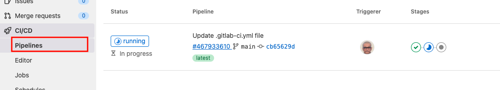

# Lab 01.1 Basic CI/CD Pipeline


Lab Objective:
- Understand a basic pipeline definition in Gitlab CICD
- See how we can define stages in a pipeline 
- See how we can run multiple jobs in a pipline 

## Preparation

You must have a Gitlab account and logged in.
Choose CI/CD from the menu.


Choose Pipelines Editor submenu item


## Lab

### Create a .gitlab-ci.yml file that uses the default build, test, and deploy stages

<details>

 _<summary>Click to see solution for a basic pipeline</summary>_

```yaml
build1:
  stage: build
  script:
    - echo "Build stage"

test1:
  stage: test
  script:
    - echo "Test Stage Job1"
    - echo "For example run a test suite"

deploy:
  stage: deploy
  script:
    - echo "Deploy stage"
```
</details>




### Update the pipeline to define custom stages

<details>

 _<summary>Click to see the solution for a pipeline with three custom stages</summary>_

```yaml
stages:
  - build
  - test
  - deploy

build1:
  stage: build
  script:
    - echo "Build stage"

test1:
  stage: test
  script:
    - echo "Test Stage Job1"
    - echo "For example run a test suite"

deploy:
  stage: deploy
  script:
    - echo "Deploy stage"
```
</details>


### Update the pipeline with a test stage that has two jobs that run parrallely

<details>

 _<summary>Click to see the solution for parallel job execution</summary>_

```yaml
stages:
  - build
  - test
  - deploy

build1:
  stage: build
  script:
    - echo "Build stage"

test1:
  stage: test
  script:
    - echo "Test Stage Job1"
    - echo "For example run a test suite"

test2:
  stage: test
  script:
    - echo "Test Stage Job 2"
    - echo "For example run a lint test"

deploy:
  stage: deploy
  script:
    - echo "Deploy stage"
```
</details>


## Congratulations! You have completed lab 01.1


